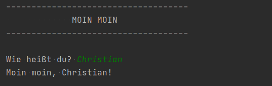

# Schritt 1: Moin Moin, Welt!

So soll das fertige Programm aussehen:

Der **weiße** Text ist die Ausgabe des Programms. Der **grüne** Text wird vom Benutzer eingegeben.

Was wird gelernt?
-------------------

* `print('text')`
* `text = input('Frage an den Benutzer')`
* Textstrings können mit `+` zusammengefügt werden

Hinweis: Es geht nicht (nur) darum, die ersten Funktionen der Sprache zu lernen. Die erste Aufgabe ist vor allem ein Test, ob alles richtig installiert ist und läuft: Python 3, PyCharm und git.
