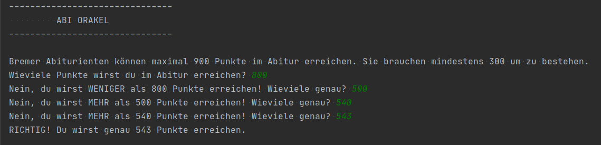

# Projekt 2: Das Abi-Orakel

So soll das fertige Programm aussehen:

Versucht, das abgebildete Programm selbst zu bauen. Der **weiße** Text ist die Ausgabe des Programms. Der **grüne** Text wird vom Benutzer eingegeben.

Das könnte dir helfen:
-------------------
**String Formatierung**

`"Deine Zahl war {}.".format(zahl)`

**If-Abfragen (Bedingte Anweisungen)**

    if TEST:
        Anweisung ausführen
    elif TEST:
        Anweisung ausführen
    else:
        Anweisung ausführen
        
**Schleifen**

    while TEST:
        Code im Loop ausführen
        Code im Loop ausführen

**Module importieren**

    import os
    print(os.sys.version)
    
**Zufallszahlen**

Zufallszahlen werden mit der Methode `randint()` im Modul `random` erzeugt. Du musst erst das Modul importieren und dann die Methode mit `random.randint(min,max)` aufrufen.

**Typumwandlung (Type Casting)**

Um zu testen, welcher Datentyp bei einer Variablen vorliegt, kannst du die Funktion `type(VARIABLE)` verwenden.

Um aus einem Textstring `str` eine Ganzzahl `int` zu machen, verwendest du die Funktion `str(GANZZAHL)` oder `int(STRING)` .  