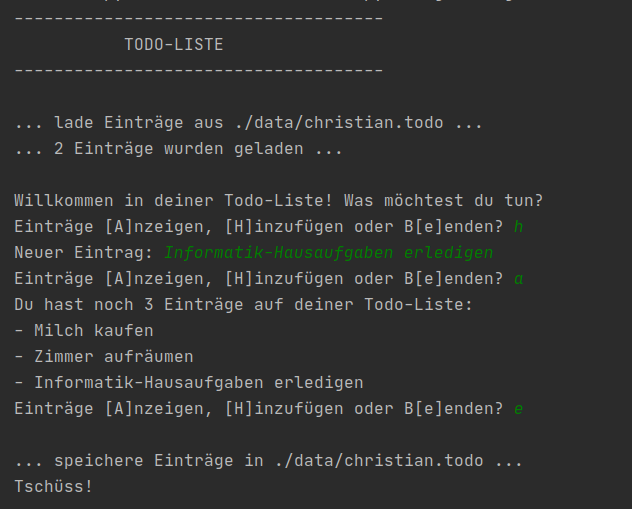
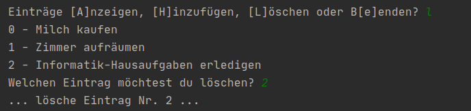

# Projekt 4: Todo-Liste

Versucht, das abgebildete Programm selbst zu bauen. Der **weiße** Text ist die Ausgabe des Programms. Der **grüne** Text wird vom Benutzer eingegeben.

## Das könnte dir helfen:

**Listen**

    namen = ['Jule', 'Nils', 'Lena']
    zweiter_namen = namen[1]
    namen.append('Benny')
    # namen -> ['Jule', 'Nils', 'Lena', 'Benny']
    
Es gibt noch viele weitere Methoden wie `.append()` für den Datentyp "Liste". Du findest sie in der [Python-Dokumentation](https://docs.python.org/3/tutorial/datastructures.html).

**Länge**

`len()` gibt die Länge eines Objekts als Ganzzahl zurück:

    lehrer = ['DRI', 'MAT']
    len(lehrer)
    # -> 2

**Dateien bearbeiten**

Betriebssysteme (Windows, MacOS, Linux) benutzen unterschiedliche Pfadangaben. Mit der Standard-Bibliothek `os` können diese Pfade unabhängig vom Betriebssystem erstellt werden.

    import os
    dateipfad_manuell = os.path.join('user', 'desktop', 'photo.jpg')
    # dateipfad_manuell -> 'user/desktop/photo.jpg' (Linux) oder 'user\desktop\photo.jpg' (Windows)
    dateipfad_voll = os.path.abspath('photo.jpg')
    # dateipfad_voll -> /home/tim/desktop/photo.jpg (Linux) oder 'C:\Users\Tim\Desktop\photo.jpg' (Windows)
    
Um Dateien zu schreiben nehmen wir `open()` und den Kontextmanager `with .. as ..:`

    with open(dateipfad, 'r') as datei_gelesen:
        text = datei_gelesen.readlines()
        # text -> ['Zeile eins\n', 'Zeile zwei\n', ...]

## Bonusaufgabe:

Versuche auch die Option zu implementieren, Beiträge wieder zu löschen:

Eine geeignete Methode findest du in der [Python-Dokumentation](https://docs.python.org/3/tutorial/datastructures.html) zu Listen.
